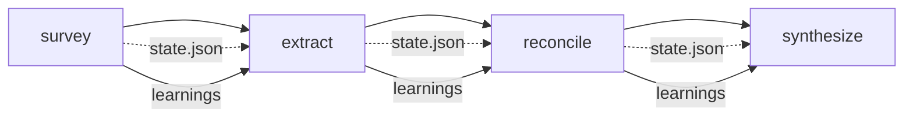

# Architecture

## Overview

Faultline is a CLI tool that orchestrates Claude to reverse-engineer codebases
into abstract product specifications. The architecture is designed around a key
principle: **the harness is deterministic, all non-determinism lives in Claude
invocations**.

## Pipeline Flow



The `analyze` command chains all four phases. Each phase reads artifacts from
`.faultline/`, writes its own artifacts, and updates `state.json` after every
task completion. This enables resuming from any failure point.

## Layers

```text
┌─────────────┐
│  commands/   │  CLI argument parsing, delegates to engine
├─────────────┤
│  engine/     │  Orchestration, analysis, Claude integration
│  ├ pipeline/ │  Phase sequencing (analyze, survey, extract, reconcile, synthesize)
│  ├ claude/   │  Subprocess management, prompt loading, response parsing
│  └ (core)    │  File walking, token estimation, batch packing
├─────────────┤
│  stores/     │  Disk persistence (.faultline/ artifacts)
├─────────────┤
│  ui/         │  Terminal output (spinners, logs, reporters)
├─────────────┤
│  agents/     │  Prompt templates (markdown files)
└─────────────┘
```

### commands/

Thin shells. Parse CLI args via commander, call into `engine/pipeline/`, and
report results via `ui/`. No direct file I/O or Claude interaction. Each file
maps to one CLI subcommand: analyze, survey, extract, reconcile, synthesize,
dry-run, status.

### engine/

All orchestration and analysis logic. Decides what to do and in what order.

- **pipeline/analyze.exec.ts** — End-to-end pipeline orchestration. Chains
  survey → extract → reconcile → synthesize with resume support, budget ceiling
  enforcement via BudgetExceededError, and graceful SIGINT handling. Sets the
  global budget limit and installs/removes signal handlers.
- **pipeline/survey.exec.ts** — Survey phase. File indexing, manifest parsing,
  tree generation, file classification, domain mapping, adversarial domain
  review, extraction plan generation, and architecture description.
- **pipeline/extract.exec.ts** — Extraction phase. Per-domain parallel
  execution with per-batch serial execution. Includes consolidation, review,
  validation retry, deep pass for high-priority domains, and learnings.
- **pipeline/reconcile.exec.ts** — Reconciliation phase. Builds a domain
  interaction graph from declared dependencies and observed references, finds
  connected components, reconciles clusters via Claude.
- **pipeline/synthesize.exec.ts** — Synthesis phase. Domain summaries, per-domain
  spec writing with abstraction enforcement, overview, architecture refinement,
  constraints, and taste extraction.
- **claude/invoke.ts** — Subprocess management for `claude --print`. Handles
  timeout enforcement (kills the child process), retry with exponential backoff,
  cost capture, budget ceiling checking, and a process registry for graceful
  SIGINT cleanup.
- **claude/prompt_loader.ts** — Template loading from `src/agents/` with
  `{{variable}}` interpolation.
- **claude/response_parser.ts** — Extracts JSON blocks, markdown sections, and
  markdown body from Claude output.
- **file_walker.ts** — Recursive directory traversal with glob-based
  include/exclude filtering.
- **token_estimator.ts** — Estimates token counts from file sizes. Code files
  use `ceil(bytes/4)`, prose files use `ceil(bytes/5)`.
- **batcher.ts** — Greedy bin-packing of items into token-budgeted batches.
  Oversized domains are split by layer (models → routes → services → tests).

### stores/

Owns every file under `.faultline/`. Each module manages a specific artifact
group. Pure data I/O: read JSON, write JSON, validate size constraints. No
orchestration logic.

- **state.ts** — Pipeline state persistence and resume detection
- **budget.ts** — Per-invocation cost logging with model-specific pricing
- **config.ts** — Three-tier config resolution (defaults → config.json → CLI flags)
- **survey.ts** — Survey phase artifacts (file_index, domains, etc.)
- **extractions.ts** — Extraction artifacts (batch notes, consolidated notes, reviews)
- **reconciliation.ts** — Cross-reference report read/write
- **synthesis.ts** — Domain summaries read/write
- **output.ts** — Final deliverable output with ridgeline copy support
- **learnings.ts** — Two-tier learnings system (bounded active set + full log)
- **validation.ts** — Token ceiling enforcement (5k tokens / ~20k chars)

### ui/

Terminal output only. Spinners, progress indicators, formatted tables, log
levels. Imported by `commands/` and `engine/pipeline/`, never by `stores/`.

- **log.ts** — Structured logging with color (info, success, warn, error, debug, step)
- **spinner.ts** — Terminal spinner for long-running operations
- **reporter.ts** — Status/budget/survey/dry-run formatters with duration tracking

### agents/

Markdown prompt templates loaded at runtime. Simple `{{variable}}` interpolation
is handled by the harness. These files are not Claude Code agents — they are
system prompts passed to `claude --print`.

## Key Design Decisions

### Why shell out to `claude --print`?

The harness stays thin. Claude handles all analysis. The subprocess boundary
provides natural isolation, timeout enforcement, and cost tracking without
managing API connections directly.

### Why a two-tier learnings system?

The **full log** is append-only and preserves everything for debugging. The
**active set** is bounded to 3k tokens and compressed by dropping low-priority
entries (hypotheses first, contradictions last). This keeps cross-phase context
focused without losing history.

### Why greedy bin-packing?

Files are packed into batches greedily because the ordering matters — files in
the same directory should end up in the same batch when possible. A greedy
approach preserves locality while respecting token budgets.

### Why no API SDK?

The constraints require using `claude --print` for all model invocations. This
keeps the harness dependency-free (only commander for CLI parsing) and makes
it easier to swap models or use different Claude configurations.

### Why global budget limits?

Budget ceiling enforcement needs to check before every Claude invocation across
all pipeline phases. Rather than threading `max_budget_usd` through every
function call, the `set_budget_limit()` function sets a module-level variable
that `invoke_claude` checks automatically. This keeps the phase executors clean.

### Why per-invocation budget checks?

The `--max-budget-usd` ceiling is enforced by `invoke_claude` before each
subprocess spawn. When the ceiling is exceeded, a `BudgetExceededError` is
thrown, which the `analyze` pipeline catches to save state and exit gracefully.
This gives finer-grained control than checking only between phases.

## Data Flow

```text
Survey:
  codebase → [file walker] → file_index.json
           → [classifier]  → file_index.json (updated)
           → [domain mapper] → domains.json
           → [domain review] → domain_review.json
           → [plan builder]  → extraction_plan.json
           → [architecture]  → architecture.md
                             → learnings.json

Extract:
  file_index + domains + plan → [batch extractor] → batch-NN.notes.md
                               → [consolidator]   → consolidated.notes.md
                               → [reviewer]       → review.json
                               → [deep pass]      → deep_pass.notes.md
                                                   → learnings.json

Reconcile:
  domains + consolidated notes → [graph builder] → interaction graph
                                → [clusterer]    → clusters
                                → [reconciler]   → cross_references.json
                                                 → learnings.json

Synthesize:
  consolidated notes + cross_refs → [summarizer]  → domain_summaries.json
                                  → [spec writer] → specs/<domain>/*.md
                                  → [enforcer]    → abstraction scan + rewrite
                                  → [overview]    → specs/00-overview.md
                                  → [arch refine] → architecture.md
                                  → [constraints] → constraints.md
                                  → [taste]       → taste.md
```

## Resume Architecture

```text
┌──────────────────────────────────┐
│          state.json              │
│  ┌───────────┐ ┌───────────┐    │
│  │  survey   │ │  extract  │    │
│  │ completed │ │  running  │    │
│  │           │ │  tasks:   │    │
│  │  tasks:   │ │  ✓ auth   │    │
│  │  ✓ index  │ │  ✓ tasks  │    │
│  │  ✓ class  │ │  ○ api    │    │
│  │  ✓ domain │ │           │    │
│  └───────────┘ └───────────┘    │
└──────────────────────────────────┘
         ↓ re-run
  skip survey (completed)
  skip auth extraction (completed)
  skip tasks extraction (completed)
  resume from api extraction (pending)
```

Each phase executor checks task status before executing. The `analyze` command
checks phase status. SIGINT triggers state persistence before exit. Re-running
any command picks up from the first incomplete task.
